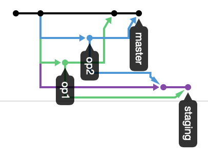

1. checkout `operation1` branch
```
git checkout operation1
```
2. create, add, commit and push `operation1.md` file
```
git add operation1.md
git commit -m "add operation1.md"
git push origin HEAD
```
3. checkout `operation1` branch after:

4. add image and fix md file
5. add, commit and push `operation1.md` file
```
git add -A
git commit -m "add an image and fix operation1.md"
git push origin HEAD
```
6. merge with `operation` branch
```
git merge operation
# Merge made by the 'recursive' strategy.
```
7. push some commits
```
git push origin HEAD
```
